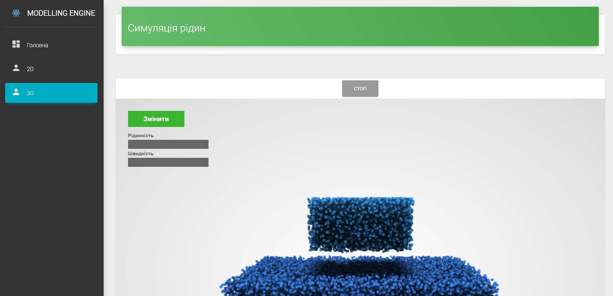

# Modelling engine

Веб додаток **Modelling engine** призначений для відоброження симуляцій розроблених в рамках магістерського проекта групи студентів ЧНУ.

Основний стек технологій веб-додатка:
- **ReactJS** (прісет Create-React-App) в якості клієнтського фреймворка
- **ExpressJS** в якості сервера

Для рендерінга симуляцій використовувались:
- **ThreeJs**
- **WebGL**
- **LiquidFun**

Спробувати проект онлайн можна за **[посиланням](https://determined-thompson-b865fb.netlify.com)**